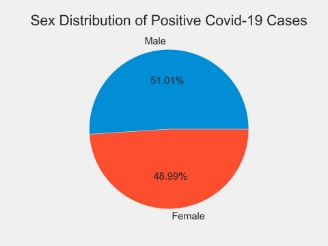
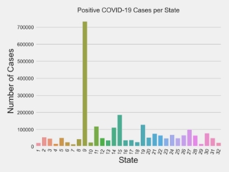
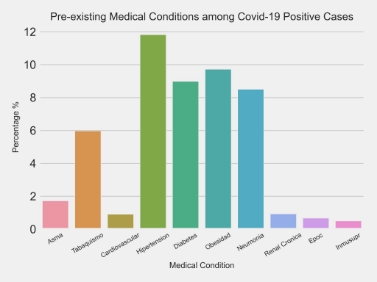
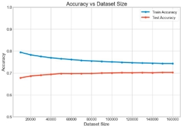
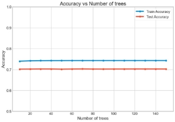
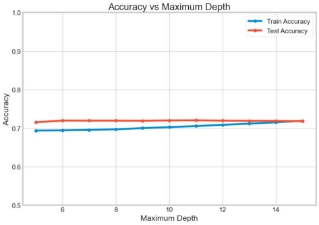
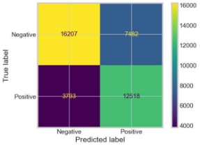
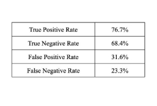

## Raniery Mendes and Ash Rai 

CSC 674: Machine Learning March 23, 2023

**Covid-19 Prediction Using Random Forest Ensemble**

1. Exploratory Data Analysis

1\.1 Dataset Description

The dataset contains information about the cases of Covid-19 in Mexico for the year 2021, provided by the Mexican government. There is a total of 8,830,345 data points with 39 features. The features include basic demographic information about the patient (e.g. age, sex, pregnancy), medical history (e.g. Asthma, Diabetes, Cardiovascular), and hospitalization details (e.g. admit date, discharge date).

1\.1 Analysis Findings

Figure 1. Sex Distribution among patients infected by Covid-19

The plot above shows an interesting gender balance in the distribution of Covid-19 positive cases. According to the dataset, 51.09% of all positive cases inflicted individuals who self-identify as male, while 48.91% inflicted individuals who self-identify as female. Even though there is a small gender

disparity, these numbers are interesting because they reflect what other research studies have found: men are more susceptible to covid-19 than women.

Figure 2. Covid-19 Cases among Mexican States

While the large majority of states faced a rate of positive Covid-19 cases lower than 100,000 cases, states #9 (Mexico City) and #15 (México) presented the highest concentration of cases. In fact, the former concentrated 29.02% of all positive cases in Mexico during 2021. This piece of information is very relevant once it tells us that 733,240 individuals got infected by that disease. This is more than 500,000 cases than the second state with the highest number of positive cases. On the other hand, states #4 (Campeche), #7 (Chiapas), and #29 (Tlaxcala) were the ones with the lowest rate of infection by Covid-19, those states had respectively 17106, 14308, and 16431 positive cases.

Another aspect revealed by the data regards how the infection by Covid-19 affected patients' health. Our explorative data analysis found that only 1.2% of all patients diagnosed with the disease had to be intubated during their stay in the hospital. Further, only 0.87% of infected patients needed more careful treatment and were allocated to the ICU.

When it comes to pre-existing medical conditions, hypertension comes to be the most common pre-existing condition among COVID-19 cases in Mexico, with 11.82% of positive cases having this condition. Interestingly, this reflects a global pattern as hypertension is a common comorbidity among more severe COVID-19 patients. Moreover, that disease is followed by obesity, diabetes, and pneumonia which were present, respectively, in 9.72%, 8.99%, and 8.51% of the infected patients. On the other hand, medical conditions such as asthma, immunocompromised comorbidities, EPOC, and renal chronic diseases were each present in less than 2% of all Mexican Covid-19 patients.

Figure 3. Pre-existing medical conditions among patients infected by Covid-19

2. Covid-19 Prediction Using Random Forest
1. Dataset Preprocessing
1. Feature Extraction

The goal of the project was to model and predict whether a patient has Covid-19 or not based on other medical information. For the simplification of this purpose, we decided to get rid of any features that are not directly related to the biological health of the person such as residence, nationality, and language-related features. We also removed any metadata features like the update dates and registration id. Finally, other good practices like removing near-zero variance columns, and highly correlated features, were followed. We ended up with 18 features at the end.

2. Datapoints Selection

The dataset includes 7 different values for the final covid classification (i.e true prediction). 1, 2, and 3 refer to positive cases, 7 to negative cases, and 4, 5, and 6 to other cases that are undetermined (i.e. does not signify if negative or positive). Hence, only data points that had values 1, 2, 3, and 7 were selected. There were about 2.5 million data points for positive cases and 6 million data points for negative cases. However, we had many rows that had the value 97/98/99 for categorical features like for different diseases. Ideally, we would expect these features to only have values 1 (positive) or 2 (negative). Due to the large dataset size, we decided to remove rows with values other than 1 or 2 for binary features.

We ended up with 121,000 covid positive data points and 112,000 covid negative data points. We proceeded to split the dataset into a training set of 160 thousand data points and a testing set of 40 thousand data points. The datasets were balanced to have an equal number of positive and negative cases, without any overlap between the training and testing sets.

2. Methodology
1. Baseline Model

For the most basic benchmark, we created a decision tree model. The complete training set of 160,000 data points was used for training and the complete testing set of 40,000 data points was used for evaluation. The default model hyperparameters were used to build the model. A second baseline model was created using the random forest ensemble. Again, the complete training and testing sets were used for training and evaluation. Default hyperparameters were used for the ensemble as well.

2. Tuning Random Forest Model

To explore how different hyperparameters affect the ensemble’s performance, we varied 3 main

factors:

1. The train dataset size varied from 10,000 to 160,000. The test dataset size was kept constant at 40,000.
1. The number of decision trees in the random forest varied from 10 to 150. The default number of trees is 100 as provided by the Scikit-Learn library. The complete dataset was used for training.
1. The maximum depth of the decision trees in the ensemble varied from 5 to 15. Here again, the complete dataset was used for training.

Once the best set of hyperparameters was selected, we further investigated the performance of the model. Different confusion matrix-based metrics were performed and analyzed as well.

3. Results

Table 1 shows the comparison between the benchmark models (both for the decision tree and random forest), and our best model. While we saw some improvement in terms of the model prediction accuracy, it was not significant.

Table 1. Comparison of accuracy between the models

|**Model**|**Non-Default Parameters**|**Train Accuracy**|**Test Accuracy**|
| - | - | - | - |
|Baseline Decision Tree|None|74\.3%|69\.6%|
|Baseline Random Forest|None|74\.3%|70\.2%|
|Best Random Forest|Max Depth = 15|71\.9%|71\.8%|

Figures 4, 5, and 6 show the trend of the training and testing accuracy of the model with respect to particular tuning factors mentioned in section 2.2.2. The details of the hyperparameters set constant are described in the mentioned section as well. It is interesting to note that in all experiments we conducted, the range of accuracy was noticeably small (always between 68% to about 80%).

 

Figure 4. Train and test accuracy with respect to the Figure 5. Train and test accuracy with respect to the increase in dataset size. As expected, training accuracy increase in the number of trees in the ensemble. No drops while testing accuracy increases with an increase significant changes in the accuracies were observed.

in dataset size.

Figure 6. The maximum depth of the trees in the random forest was varied and the accuracies were observed. Increasing the depth seems to help improve the model’s accuracy.

Finally, once we selected our best model after the hyperparameters tuning, we analyzed the performance in more depth. A confusion matrix has been presented below, along with the relevant metrics.

 

Figure 7. The model seems to have a better performance in terms of the true positive rate compared to the true negative rate. The false positive rate runs high, which is a slight concern we have in the context of Covid.

4. Discussion and Future Work

In terms of hypertuning, as expected, increasing the dataset size helped with improving the test accuracy, as well as the generalizability of the model. With our smallest training set size of 10,000, we attained a high train accuracy of around 80% with a low test accuracy of around 67%. With our largest training set of 160,000 data points, the training accuracy dropped to around 74% and test accuracy increased to 70%. Surprisingly, varying the number of trees in the random forest did not significantly affect the accuracies. We know that generally, the performance of random forests improves with the number of trees for a range, after which it plateaus. It almost seems like even with our smallest ensemble size of 10 trees, we were already fairly close to that plateau. The maximum depth of the trees was an interesting hypertuning and helped us produce our best model. With the increase in the depth parameter, we saw an increase in test accuracy as we did in other hypertuning experiments, but also a significant improvement in the generalizability of the model.

Our best model in terms of accuracy attained a test accuracy of 71.8%. The training accuracy was at 71.9% so the model seems to have generalized fairly well. However, looking at the confusion matrix metrics, the model still seems to suffer from a high false positive rate. As a predictive model meant for identifying if a patient might have covid or not, this is a big concern. Future work would focus on identifying the cause of this high false positive rate and minimizing it. Besides that, we would like to have more comprehensive data about the patients’ medical charts once such features would offer the proper information that is used for diagnosing one’s health condition. However, we acknowledge that would be a hard advance to achieve once obtaining that kind of data may harm patient confidentiality.

References

1. Almustafa, Khaled Mohamad. “Covid19-Mexican-Patients' Dataset (Covid19MPD) Classification and Prediction Using Feature Importance.” Concurrency and computation: practice & experience vol. 34,4 (2022): e6675. doi:10.1002/cpe.6675
1. *Covid 19*.[ https://kaggle.com/code/ramanrdk/covid-19](https://kaggle.com/code/ramanrdk/covid-19). Accessed 20 Mar. 2023.
1. Secretaría de Salud. “Datos Abiertos Dirección General de Epidemiología.” *gob.mx*, <http://www.gob.mx/salud/documentos/datos-abiertos-152127>. Accessed 21 Mar. 2023.
1. Shafi, Adam. *Random Forest Classification with Scikit-Learn*. <https://www.datacamp.com/tutorial/random-forests-classifier-python>. Accessed 21 Mar. 2023.
1. “Sklearn.Ensemble.RandomForestClassifier.” *Scikit-Learn*, <https://scikit-learn/stable/modules/generated/sklearn.ensemble.RandomForestClassifier.html>. Accessed 21 Mar. 2023.
